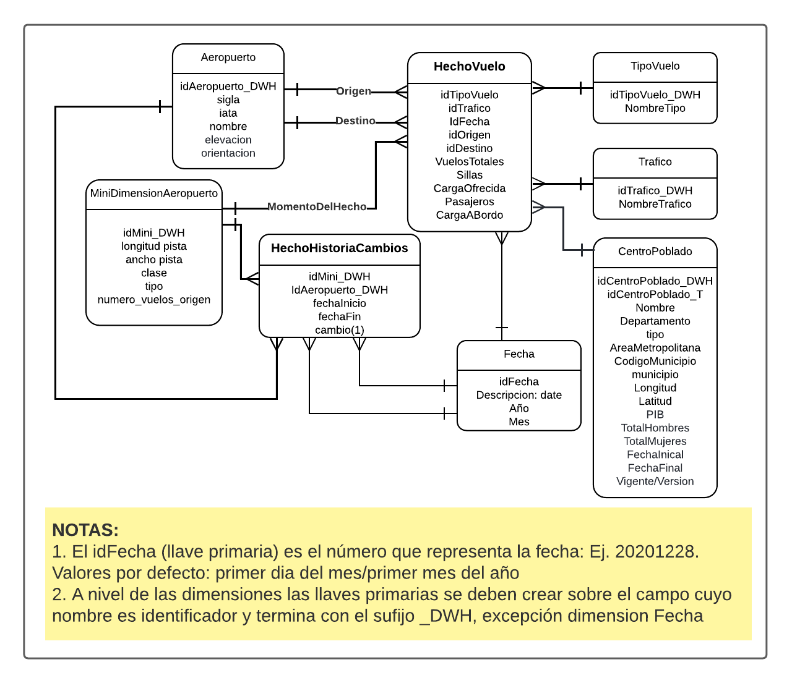

# **Construir un proceso ETL**
## **Objetivo**
- Implementar el proceso ETL del proyecto.  
## **Instrucciones**

En esta fase del proyecto, a partir de la capacitación recibida en los diferentes temas, algunos ejemplos de análisis requeridos, aclaraciones de la organización sobre los datos compartidos inicialmente y de un modelo multidimensional con manejo de historia propuesto, Infraestructura Visible considera que están listos para realizar todo lo relacionado con el proceso de ETL. En particular requiere que trabajen en los siguientes entregables:

1. **Entregable 1 - Diseño del ETL:** Incluir la **corrección** del diseño ETL propuesto para poblar las tablas asociadas al modelo multidimensional dado, utilizando como fuentes, las compartidas. Esto incluye manejo de historia
2. **Entregable 1 - Implementación del ETL:** implementación del proceso ETL de las dimensiones y tabla de hechos del proyecto incluyendo manejo de historia.

A nivel de trabajo en grupo, dada la experiencia que la empresa tiene en este estilo de proyectos, le sugiere lo siguiente:
- Cada miembro del grupo se haga responsable de una dimensión o de dos si la dimensión es básica.
- Definan de forma conjunta el proceso a seguir para las transformaciones y cargue de la tabla de hechos
- El miembro con las dimensiones más sencillas o el menor número de dimensiones asignadas trabaje la tabla de hechos. 

## **Recursos requeridos**
***Datos suministrados***

Los datos los puede encontrar en la base de datos: ProyectoTransaccional del servidor que manejamos en los tutoriales. También puede encontrar el diccionario **actualizado** de los mismos [aquí](https://github.com/MISW-4402-Analisis-y-Modelado-de-datos/guias/blob/main/docs/Proyecto/Diccionario%20IV.xlsx), ambos recursos requeridos para el desarrollo de esta tarea, las tablas son copias de las tablas relacionales del negocio. Los datos que se usaron para el entendimiento de datos quedan disponibles en las tablas <i> aeropuertosCopia, divipolaCopia, vuelosCopia, pibCopia y	proyeccionesCopia </i> en caso de que deseen repasar o rehacer el ejercicio de Entendimiento. Los datos revisados por Infraestructura visible a partir de los resultados y/o conclusiones que obtuvieron en el entenimiento y que deben ser utilizados en el proceso de ETL quedan en las tablas:
-	aeropuertos
-	divipola
-	vuelos
-	pib 
-	proyecciones

Para la fecha, si no hay día o mes asuma como valores por defecto el pimer día del mes, y el primer mes de cada año

***Respuestas del negocio a conclusiones de Entendimiento***

En general el negocio les comenta que tienen datos hasta 2015, sin embargo les hacen entrega de información desde 2015 hasta 2017 para el manejo de historia
- Se revisaron los datos y se completó la información de los 10 departamentos y los 2 años que faltaban de los datos.
- Infraestructura Visible está de acuerdo en que hay varios nombres para algunos departamentos, y acogen la propuesta de estandarizar los datos, transformación que será responsabilidad de ustedes
- Infraestructura Visible está de acuerdo con que ustedes eliminen los duplicados totales que encontraron en los datos
- La regla 2 de negocio es correcta en términos de tiempo, cuando dijeron datos hasta 2015, no incluian el 2015, sino hasta diciembre de 2014
- Se revisaron los datos y se completó la información de los 2 departamentos que faltaban en los datos y los datos de proyecciones según edad para cada género
- El valor real de hombre para Valle del cauca en 2014 es incorrecto, les piden que hagan la corrección (les recomendamos pensar en este caso, con los datos que tienen, ¿cuál es el mejor método de imputación?)
- También le solicitan imputar el valor extremo de la variable <i>total Mujeres </i>
- Se revisó la columna constante DP, que representa el código del departamento y se asignaron los valores reales
- Infraestructura Visible les comenta que se hicieron las revisiones y se quitaron los duplicados que variaban en las columnas carga_bordo, carga_ofrecida y pasajeros_en_vuelos de la tabla de aeropuertos
- Se completó la información de aeropuertos origen y destino que faltaba
- Infraestructura Visible está de acuerdo con la estandarización de los meses y esta transformación será responsabilidad de ustedes
- Se corrigieron los valores de longitud de pista, se agregaron las categorías para los aeropuertos que no son aerodromos
- Se revisó la columna constante de Latitud de los aeropuertos y se corrigieron los valores
- Les solictan que corrijan los valores negativos de numero_vuelos_origen, multiplicando por -1
- Se revisaron las columnas Código Departamento y Nombre Municipio de la tabla divipolaCopia, se corrige el nombre del municipio pero les solicitan corregir el código del departamento, usando como base la tabla de PIB. 
- Con respecto a los nombres de los departamentos que presentan errores el negocio les recomienda primero estandarizar los nombres haciendo uso de diccionarios y luego revisar duplicados para finalmente lograr hacer las integraciones que sean necesarias 
- Se eliminaron los registros inconsistentes, donde aparecia el mismo centro poblado ubicado en distintos puntos geográficos según sus variables de latitud y longitud
- Un centro poblado es una concentración de mínimo 20 viviendas contiguas donde el negocio asume que un aeropuerto está *asignado* a un centro poblado y un centro poblado solo puede estar en un municipio
- Las siglas de tráfico significan: N = Nacional, I = Internacional, E= postal o urgentes. Las siglas de tipos de vuelos significan: R= regular, T= taxi, C= chárter, A= adicionales

***Modelo multidimensional propuesto*** 
El modelo propuesto muestra dos tablas de hecho. La primera de ellas **HechoVuelo**, representa el proceso de registro de vuelos que es un histórico de los vuelos realizados desde o hacia aeropuertos en Colombia entre 2005 y 2017. La granularidad del hecho es de carácter mensual, y cada registro contiene el mes-año, aeropuerto de origen, aeropuerto de destino, centro poblado al cual fue asignado el aeropuerto, las características del aeropuerto en el momento del reporte, tipo de vuelo (Chárter, Regular, Taxi o Adicionales, etc.), tipo de tráfico (Internacional, Nacional, etc.), total de vuelos realizados y el número total de sillas en esos vuelos, carga ofrecida para los vuelos realizados, pasajeros que viajaron y generaron ingresos a la aerolínea y carga a bordo de los vuelos. 
La segunda tabla de hechos **HechoHistoriaCambios** almacena la historia de los cambios realizados en los aeropuertos a nivel de longitud, ancho, clase, tipo y dado que es una *factless*, como medida se adicionó el campo cambio que es una constante de valor “1”.
Con respecto al manejo de historia de atributos, **Centro Poblado** tiene un **manejo tipo 2** que permite registrar entre otros cambios el tipo de centro poblado o proyecciones. Mientras que, para **aeropuerto**, se propuso un **tipo 4**, creándose la minidimensión MiniDimensiónAeropuerto.

***Tecnología***

Recuerden que están los tutoriales "Proceso ETL" y "Proceso ETL Incremental"

## **Recomendaciones de los entregables**

Incluir en la entrega la dirección (URL) de la wiki de su repositorio <i>Estudiante_i</i> donde registró lo solicitado en esta tarea con las actividades realizadas dentro de las fechas establecidas

## **Preguntas o más información**
- Si el cargue de datos con la función <i>guardar_db()</i> se demora, hacer uso del código de cargue por lotes que encuentra en el Tutorial de ETL al final del bloque 6: Hecho orden
- Recuerde que puede hacer reemplazos de cadenas de caracteres haciendo uso de diccionarios, puede encontrar un ejemplos en el siguiente enlace: https://sparkbyexamples.com/pyspark/pyspark-replace-column-values/
- Las preguntas que surjan en el desarrollo de esta tarea pueden registrarlas en el slack del curso
- Recuerde que tiene a su disposición el tutorial de Creación y manejo de la Wiki [aquí](https://misovirtual.virtual.uniandes.edu.co/codelabs/wiki-github/index.html?index=..%2F..ETL#0)
