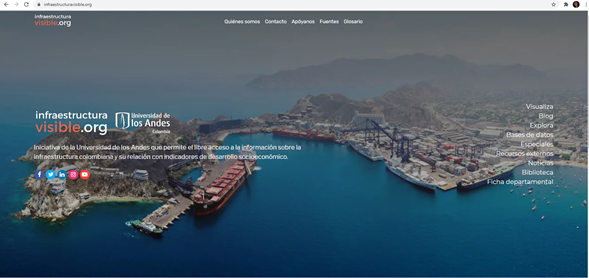
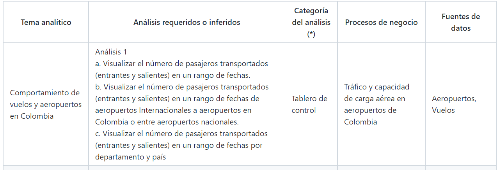
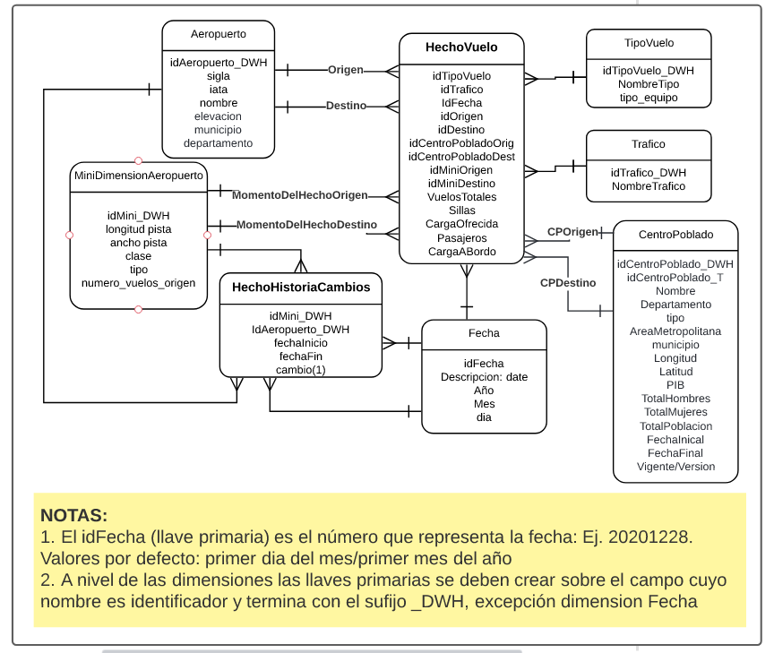

# **Terminación, comunicación y evaluación del proyecto final**
## **Objetivo**
- Construir tableros de control para facilitar la interacción con los datos y la identificación de hallazgos útiles para una organización
- Utilizar el resultado de un ejercicio de analítica descriptiva para identificar su utilidad en el contexto de una organización
- Comunicar el resultado de analítica descriptiva a personas de nivel ejecutivo de una organización
- Aplicar una metodología para el desarrollo de proyectos de analítica descriptiva desde el entendimiento de los datos hasta la visualización del resultado
## **Instrucciones**

En esta fase del proyecto, Infraestructura Visible desea que trabaje en su grupo para concluir las actividades del proyecto y tener la oportunidad de interactuar con las soluciones de otros grupos, construidas en el curso. 

En particular se espera que realice las siguientes actividades:
1.	***Entregable 1: Tableros de control y desripción de dos análisis.*** Deben proponer dos mock-up de los tableros de control y construirlos. Cada tablero de control debe permitir resolver un análisis planteado por ustedes, alineado con los requerimientos de infraestructura visible. El primero de ellos relacionado con las dimensiones (incluido minidimensión aeropuerto y el hecho de historia de aeropuertos) y otro con los vuelos (la tabla de hechos vuelos y las dimensiones que consideren necesarias). Los tableros deben conectarse a la base de datos que toma el rol de bodega de datos donde están los datos cargados. Para revisar los tableros deben enviar el enlace con la configuración habilitada para edición. Recuerden que este último paso se describe en el tutorial de tableros de control. En esta parte, deben documentar los requerimientos utilizando la tabla que se ha utilizado en enunciados previos, donde se incluye, tema analítico, análisis requerido, datos, entre otro, como se muestra en la siguiente figura.

2.	***Entregable 2: Video:*** Video para directivos de una organización donde se espera aplique lo visto en el curso, en particular en el tema de comunicación. Poner el video en este [padlet con contraseña: miso_proyectos202219](https://uniandes.padlet.org/lj_romero/sk6fhghzovh1en02)
3.	***Entregable 3: Coevaluación entre equipos:*** Tendrán la oportunidad de ver el video de otro grupo, al igual que interactuar con los tableros que ese grupo desarrolló como parte de este proyecto. En este punto se espera que pueda darle una retroalimentación valiosa para valorar las fortalezas identificadas en el proyecto y los puntos a mejorar. Esta retroalimentación incluye una calificación. Utilice los criterios definidos de la entrega para asignar esa nota. **Recuerde que el envio para realizar esta actividad la realiza únicamente el líder del grupo**. **Esta actividad debe realizarse dos días después de la entrega del proyecto en el recurso coevaluación entre equipos: entrega final del proyecto**.
4.	***Entregable 4: Coevaluación entre integrantes del equipo:*** Tendrán la oportunidad de reflexionar sobre el trabajo en equipo, realizado en el proyecto y llegar a consensos sobre esa parte. Utilice los criterios definidos de la entrega para asignar esa nota y hacer comentarios.
5. ***Entregable 5: Opcional Bono de 20/100 puntos en la nota de la entrega del proyecto*** En el proyecto, tiene la opción de tener un bono por integración de una nueva fuente de datos. Esta nueva fuente de datos debe aportar datos al modelo dimensional (si es necesario adáptelo) de igual manera debe estar en el proceso de ETL y debe ser utilizado el alguno de los tableros de control. Debe explicar esta parte e incluirlo en este entregable. Si no hace el bono, en el envío coloque NA (No aplica).

Asociada a esta entrega encuentra un segundo enlace para determinar el grupo al cual le hará la coevaluación entre equipos. De igual manera encontrará un tercer enlace para que de común acuerdo entre los miembros del grupo, evalúen el aporte y compromiso de los distintos integrantes del grupo en lo que denominamos coevaluación entre integrantes del equipo.

## **Recursos requeridos**
Todo el material desarrollado en el curso. Recuerde que estos recursos a nivel de datos y documentación los encuentra en estos enlaces del  repositorio:

●	Datos compartidos en la base de datos Proyecto_DWH_solucion, que corresponden a las tablas que representan el modelo dimensional compartido por InfraestructuraVisible como solución, el cual se presenta en la siguiente imagen.
El modelo propuesto muestra dos tablas de hecho. La primera de ellas **HechoVuelo**, representa el proceso de registro de vuelos que es un histórico de los vuelos realizados desde o hacia aeropuertos en Colombia entre 2005 y 2017. La granularidad del hecho es de carácter mensual, y cada registro contiene el mes-año, aeropuerto de origen, aeropuerto de destino, centro poblado origen y destino al cual fueron asignados respectivamente los aeropuertos origen y destino, las características de los aeropuertos origen y destino en el momento del reporte que se presentan por las dos relaciones con la minidimensionAeropuerto , tipo de vuelo (Chárter, Regular, Taxi o Adicionales, etc.), tipo de tráfico (Internacional, Nacional, etc.), total de vuelos realizados y el número total de sillas en esos vuelos, carga ofrecida para los vuelos realizados, pasajeros que viajaron y generaron ingresos a la aerolínea y carga a bordo de los vuelos. 
La segunda tabla de hechos **HechoHistoriaCambios** almacena la historia de los cambios realizados en los aeropuertos a nivel de longitud, ancho, clase, tipo, número de vuelos teniendo como origen ese aeropuerto y dado que es una *factless*, como medida se adicionó el campo cambio que es una constante de valor “1”.
Con respecto al manejo de historia de atributos, **Centro Poblado** tiene un **manejo tipo 2** que permite registrar entre otros cambios el tipo de centro poblado o proyecciones. En esta dimensión se tienen los datos de PIB y proyecciones a nivel de total de hombres, mujeres y totalPoblación que se reportaron a nivel de Departamento. A nivel de **aeropuerto**, se propuso un manejo de historia **tipo 4**, creándose la minidimensión MiniDimensiónAeropuerto.

## **Recomendaciones de los entregables**
- Incluir en la entrega la dirección de la wiki donde registraron lo solicitado en esta tarea.
- Padlet
    - Propuestas de proyecto: https://uniandes.padlet.org/lj_romero/sk6fhghzovh1en02
    - Contraseña: miso_proyectos202219
    
## **Preguntas o más información**
Las preguntas que surjan en el desarrollo de esta tarea pueden registrarlas en el slack del curso
