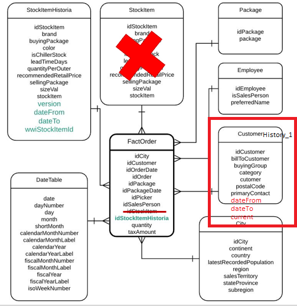

# **Tarea: Construir un ETL incremental**
## **Introducción**
### **Objetivo**
- Usar PySpark para crear ETLs con historia en los atributos de las dimensiones.  

### **¿Para qué?**
Dentro  de  procesos  de  ETL,  es común  que se  presenten  dimensiones que puedan  presentar cambios a través del tiempo para las cuales es necesario tener un plan de manejo de historia. Por lo tanto, es esencial saber cómo realizar este manejo en las distintas herramientas de ETLs.

### **¿Qué necesita?**
1. Python 3 con pip instalado
2. JupyterLabs
3. Paquetes: Pyspark (3.0.1) y pandas (1.2.1)
5. Servidor SQL con base de datos multidimensional "WWImportersDWH" que contenga la dimension "cliente_Historia"

## **Enunciado**
A partir del modelo dimensional que se presenta a continuación, en el cual se muestra el cambio con respecto a lo trabajado hasta este punto, a nivel de la dimensión Cliente, debe diseñar e implementar el proceso ETL para la nueva dimensión llamada "Cliente_Historia". En esa dimensión, el atributo categoría puede cambiar y se ha decidido utilizar el **manejo de historia tipo 2**.
En este proceso ETL se identifican dos maneras de reportar la información por parte del sistema transaccional:

a. **Escenario 1.** Envían todos los clientes

b. **Escenario 2.** Envían la última versión reportada del cliente y la versión actual, para los clientes que tuvieron algún cambio desde el último reporte hecho a la bodega.

LEIDY: AJUSTAR EL MODELO, REVISAR NOMBRES DE TABLAS Y COLOCAR EL CORRECTO. SUBIR LOS ARCHIVOS CSV PARA REALIZAR LA TAREA.

Es así como para practicar con esos dos escenarios, debe crear dos nuevas tablas para ese manejo de clientes y poblarlas con el ETL que va a desarrollar:

a. **ClienteHistoria_Escenario 1**, para la cual debe utilizar la información de la tabla **clienteHistoria** y la de este archivo:FALTAARCHIVO1

b. **ClienteHistoria_Escenario 2**, para la cual debe utilizar la información de la tabla **clienteHistoria** y la de este archivo:FALTAARCHIVO2

El supuesto que se tiene en este punto es que se hizo el proceso de entendimiento de datos sobre el archivo de clientes, se definieron las transformaciones requeridas y ahora está listo para transformar y cargar la información a la nueva tabla, guardando la información histórica del atributo categoría del cliente.

**Pregunta de interés: ¿Qué ajustes habrá que realizar a los pasos de transformar y cargar la tabla de hechos en el proceso de ETL básico, desarrrollado previamente? ** 

