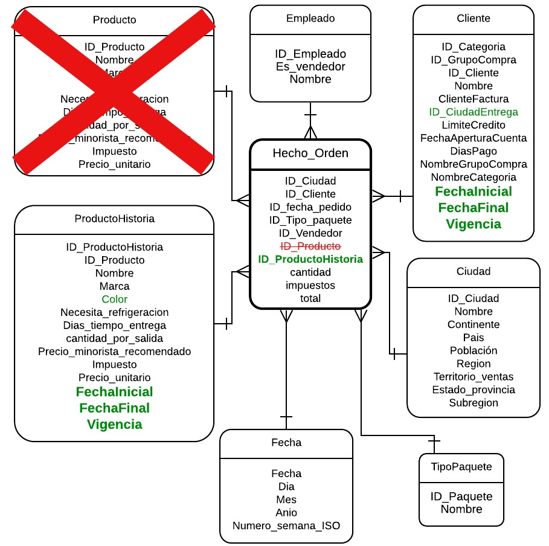

# Tarea: Construir un ETL incremental

# Introducción

**Objetivo**

Reflexionar y practicar sobre un proceso ETL incremental con historia en atributos de dimensiones en Pyspark

**¿Para qué?**

Dentro  de  procesos  de  ETL,  es común  que se  presenten  dimensiones que puedan  presentar cambios a través del tiempo para las cuales es necesario tener un plan de manejo de historia. Por lo tanto, es esencial saber cómo realizar este manejo en las distintas herramientas de ETLs, de igual manera ser conscientes que estos procesos ocurren en la mayoría de casos cuando la bodega de datos ya tiene información cargada. De esta manera van a reflexionar y practicar sobre lo aprendido en el tutorial de ETL utilizando técnicas de manejo de historia de los datos

**¿Qué necesita?**

1. Modelo multidimensional asociado al proceso de ordenes de ventas
2. Tutorial ETL Incremental 
3. Notebook para trabajar: puede usar la seccion 3 "Espacio para desarrollar la tarea" al final del notebook del tutorial para realizar esta actividad
5. Servidor SQL con base de datos relacional "WWImportersTransactional" y base de datos relacional que corresponde a la bodega de WWI "Estudiante_i" con los datos cargados de ETL
6. Archivos sql con los datos listos para cargue a bodega de datos en caso de requerirlo

# Enunciado
Ahora que sabe cómo realizar un proceso ETL con manejo de historia, dado el modelo multidimensional del proceso de negocio de **ordenes de venta**, debe enfrentar el reto de tener ciudades de los clientes que cambian en el tiempo, es decir clientes que cambian de ciudad de residencia, y que el negocio reporta de  diferentes maneras desde la base transaccional, que llamaremos escenarios. A partir de esto, reflexione sobre:
1. **Práctica 1 - Correcciones al diseño del ETL:** Reflexione sobre los ajustes requeridos en el diseño del ETL de manera que se incluya el manejo de historia 
2. **Práctica 2 - Manejo de historia:** Identifique cuáles técnicas de manejo de historia se podrían usar y actualice el modelo multimensional con base en el tipo de manejo que más adelante le sugerimos
3. **Práctica 3 - Implementación del ETL con historia:** Implemente los cambios al ETL de manera que incluya el manejo de historia

Recuerde que esta actividad es **formativa**, es decir no tendra entregable ni nota. Es una práctica que le permitirá entender lo que se requiere para realizar un ETL incremental con historia y prepararse para el momento de aplicarlo al proyecto. 

WWImporters generó dos formas distintas de reportar los datos:
- **Escenario 1.** Envían todos los clientes con o sin cambios
- **Escenario 2.** Envían la última versión reportada a la bodega de datos del cliente, y la versión actual, para los clientes que tuvieron algún cambio desde el último reporte hecho a la bodega.

Practique con ambos escenarios. Las tablas con la información para cada escenario se llaman ClientesReporte2_Escenario1 y ClientesReporte2_Escenario2. Adicionalmente, para la tabla de hechos se tiene la información para las nuevas ordenes de compra del segundo semetre de 2016 en la tabla transacional Ordenes

Como resultado de esta actividad debe publicar en el foro respectivo, dudas del proceso, que serán discutidas en las sesiones sincrónicas de esta semana
**Preguntas ejemplo:**

**1. ¿Qué ajustes habrá que realizar a los pasos de transformar y cargar la tabla de hechos en el proceso de ETL básico, desarrrollado previamente?** 
